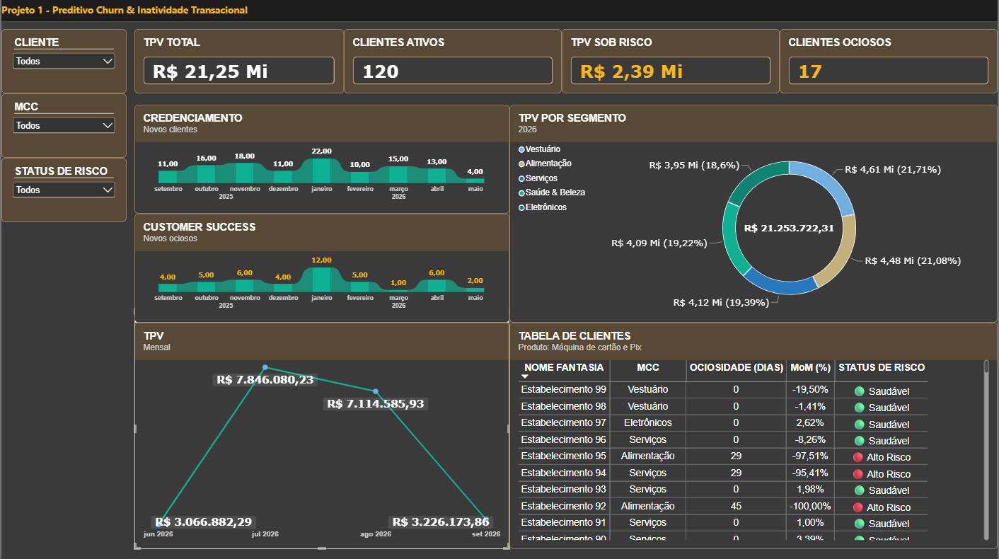

# 💳 Predictor de Churn & Inatividade Transacional em Fintechs


## 📌 Visão geral do projeto
Projeto focado em **Data Analytics & Business Intelligence** para identificação precoce de retenção, queda de volume transacional e ociosidade de lojistas (*merchants*) em arranjos de pagamento.

A solução simula o comportamento da base transacional de uma adquirente/subadquirente, permitindo acompanhar KPIs estratégicos e agir preventivamente sobre o risco de *churn*.

---

## 📊 Dashboard executivo


---

## 🎯 Problema de negócio & regras aplicadas
Em operações de credenciamento e meios de pagamento, a perda de engajamento do cliente ocorre em etapas antes do cancelamento formal:

* **Lojistas ativos**: Clientes com volume financeiro movimentado ($TPV > 0$) no mês corrente.
* **Novos ociosos**: Lojistas que transacionaram no mês anterior ($M-1$), mas apresentaram $TPV = 0$ ou ausência de movimentação no mês atual ($M$).
* **Risco de churn**: Alertas gerados com base em quedas acentuadas de volume mês a mês ($MoM$).

---

## 🛠️ Tecnologias e ferramentas
* **Python (`Pandas`, `NumPy`)**: Geração de dados sintéticos e simulação do histórico de transações diárias.
* **Power BI & DAX**: Construção do modelo de dados em estrela (*Star Schema*), métricas de inteligência temporal e painel interativo.
* **Git/GitHub**: Versionamento de código e documentação.

---

## 📂 Estrutura do Repositório
```text
├── data/
│   ├── base_analytics_churn.csv   # Cadastro e classificação de risco
│   └── transacoes_base.csv        # Log de transações simuladas
├── img/
│   └── dashboard_churn.png        # Screenshot para visualização rápida
├── scripts/
│   └── gerar_dados_churn.py       # Script Python para geração das bases
├── Projeto 1 - Preditivo Churn & Inatividade Transacional.pbix
└── README.md
```
---

## 📐 Métricas Desenvolvidas (DAX)
Entre as métricas criadas para análise contínua de risco e variação transacional, destaca-se o cálculo de migração para ociosidade:

```dax
Novos ociosos = 
VAR DataContexto = MAX(transacoes_base[data_hora])
VAR MesAtual = MONTH(DataContexto)
VAR AnoAtual = YEAR(DataContexto)

VAR MesAnterior = IF(MesAtual = 1, 12, MesAtual - 1)
VAR AnoAnterior = IF(MesAtual = 1, AnoAtual - 1, AnoAtual)

VAR TodosLojistas = CALCULATETABLE(VALUES(base_analytics_churn[id_lojista]), ALL(base_analytics_churn))

RETURN
COUNTROWS(
    FILTER(
        TodosLojistas,
        VAR LojistaAtual = base_analytics_churn[id_lojista]
        
        VAR TPV_MesAnterior = 
            CALCULATE(
                [TPV Total],
                ALL(transacoes_base[data_hora]),
                transacoes_base[id_lojista] = LojistaAtual,
                MONTH(transacoes_base[data_hora]) = MesAnterior,
                YEAR(transacoes_base[data_hora]) = AnoAnterior
            )
            
        VAR TPV_MesAtual = 
            CALCULATE(
                [TPV Total],
                ALL(transacoes_base[data_hora]),
                transacoes_base[id_lojista] = LojistaAtual,
                MONTH(transacoes_base[data_hora]) = MesAtual,
                YEAR(transacoes_base[data_hora]) = AnoAtual
            )
            
        RETURN
        TPV_MesAnterior > 0 && (ISBLANK(TPV_MesAtual) || TPV_MesAtual = 0)
    )
)
```